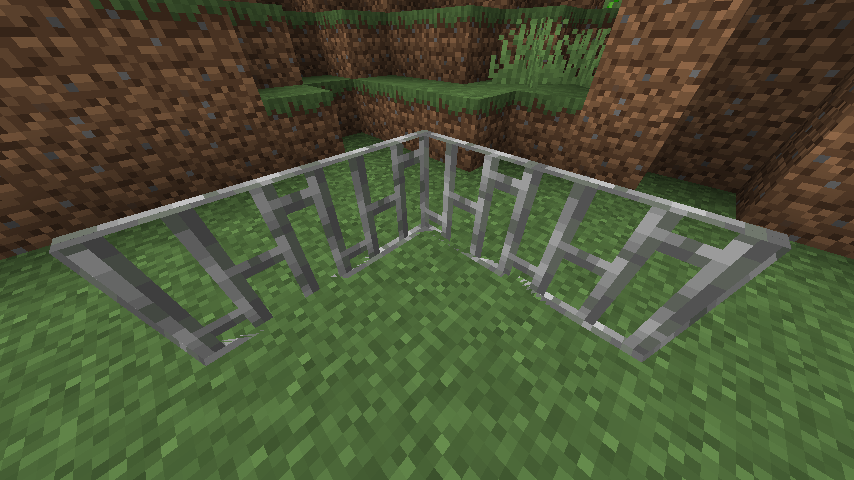
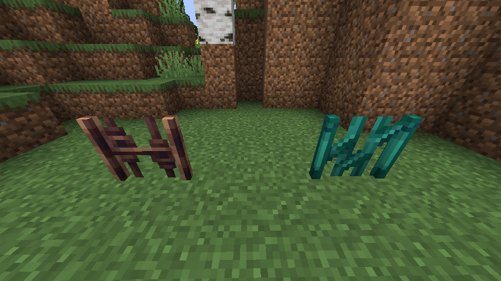

# About

**Spittin' Bars** is a small Resource Pack that redesigns Bars to look more aesthetically pleasing.

The project should be compatible with all versions of Minecraft, and compatible with the following mods:
- [Create](https://modrinth.com/mod/create)
- [Quark](https://modrinth.com/mod/quark)
- [Etcetera](https://modrinth.com/mod/etcetera)
- [Architect's Palette](https://modrinth.com/mod/architects-palette-fabric)
- *And possibly more...*

> The `classic` version of the project is designed to be compatible with Minecraft 1.12 (and possibly older versions). 

# Gallery

*How Iron Bars look in vanilla Minecraft*

*Spittin' Bars in action*

*Sunmetal and Entwine bars from Architect's Palette*

# License

This project is licensed under [CC BY-SA 4.0](https://creativecommons.org/licenses/by-sa/4.0/).

You are free to include this project in your modpacks.
